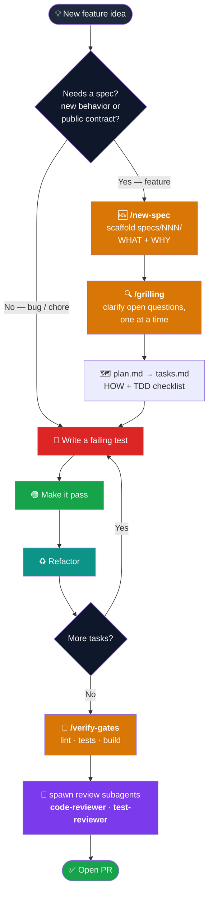
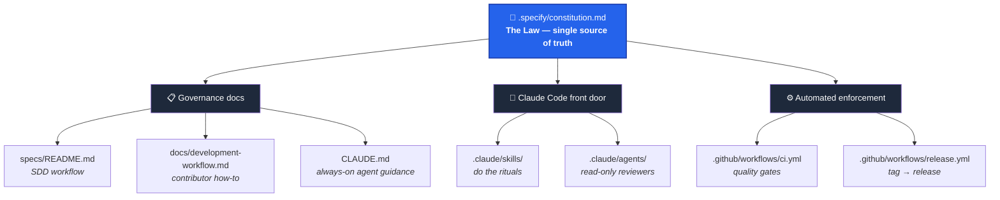
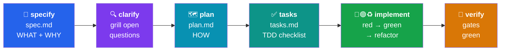
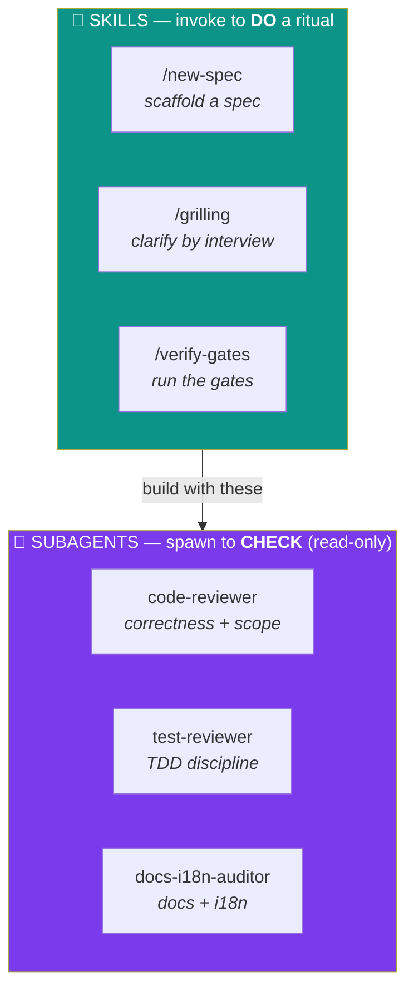
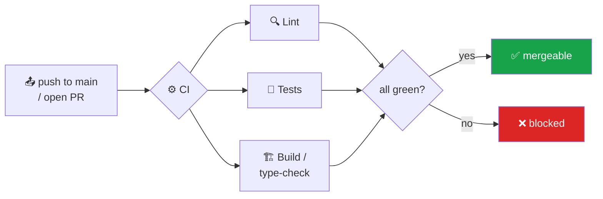
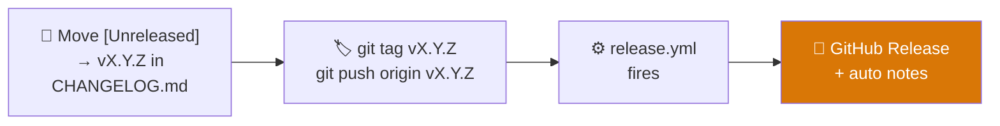

<div align="center">

# 🧭 agentic-coding-template

### A reusable starting point that gives every project the same engineering discipline

**Spec-Driven Development (SDD)** · **Test-Driven Development (TDD)** · a project **Constitution**
ready-to-use **Claude Code** skills & review subagents · automated **Releases** & **Changelog**

<br />


<br />

**🌐 Language:** **English** · [Português 🇧🇷](./README.pt-BR.md)

</div>

---

## 📑 Table of Contents

1. [Introduction](#-1-introduction)
2. [Project Architecture](#-2-project-architecture)
3. [Concepts & Philosophy](#-3-concepts--philosophy)
4. [Skills & Subagents in Claude Code](#-4-skills--subagents-in-claude-code)
5. [CI Flow and Workflows](#-5-ci-flow-and-workflows)
6. [Releases and Changelog](#-6-releases-and-changelog)
7. [Using It on a Real Project](#-7-using-it-on-a-real-project)
8. [Roadmap — Shared Standards](#-8-roadmap--shared-standards)

---

## 🚀 1. Introduction

This repository is a **template**: you don't run it, you **start from it**. Every project that
begins here inherits the same opinionated, non-negotiable way of building software — so the 10th
project on the team looks and behaves like the 1st, and any engineer (or AI agent) can drop in and
immediately know the rules.

What you get out of the box:

| 🎁 | Feature |
|----|---------|
| 📜 | A **Constitution** — the principles every change must respect, with an amendment process. |
| 🧩 | **Spec-Driven Development** — write the *what* and *why* before the code, reviewed first. |
| 🧪 | **Test-Driven Development** — acceptance criteria become failing tests before implementation. |
| 🤖 | **Claude Code** skills & review subagents, ready to invoke. |
| ⚙️ | **CI workflows** — multi-stack quality gates (Python / Node / frontend presets). |
| 🏷️ | **Automated Releases** — push a `vX.Y.Z` tag → a GitHub Release with auto notes. |

> **The one-line philosophy:** *No feature code without a spec. No behavior change without a failing
> test first. Not "done" until the gates are green.*

### 🔧 Prerequisites & first run

This template is **agent-native** — the skills and review subagents run *inside* an AI coding agent.
Pick one:

- **[Claude Code](https://claude.com/claude-code)** — the `.claude/` skills & subagents live here.
  Invoke one by typing `/new-spec` (or just ask Claude to *"write the spec first"*); `CLAUDE.md` is
  read automatically.
- **[OpenAI Codex](https://developers.openai.com/codex)** — the `.codex/prompts/` mirror the same
  workflows (`/new-spec`, `/verify-gates`, `/review-code`…); `AGENTS.md` is read automatically.

> 💡 The bundled `/`-commands only exist inside the agent CLI. Cloning the repo in a plain editor
> still gives you the constitution, the `specs/` workflow, and CI — just without the automation.

### 🗺️ The journey of a new feature

Every feature travels the same path — from idea to merged PR. The Claude Code skills (in **orange**)
and review subagents (in **purple**) plug into each step:



> A real walk-through of this flow inside Claude Code is in
> [§4 — Skills & Subagents](#-4-skills--subagents-in-claude-code).

---

## 🧱 2. Project Architecture

The template is a set of **layered front doors over one set of rules.** The Constitution is the law;
everything else is a way to apply or enforce it.



### The development stages (the conceptual pipeline)



### Repository map

```
📦 agentic-coding-template
├── 🧩 backend/                   # API · domain · data  (Python / FastAPI)
├── 🎨 frontend/                  # UI  (React + TypeScript + CSS)
├── 🤖 ai/                        # agents · prompts · RAG  (Python)
├── ☁️  infra/                    # IaC · deploy  (Terraform)
├── 📜 .specify/
│   └── constitution.md          # the non-negotiable principles (edit per project)
├── 📂 specs/
│   ├── README.md                # the SDD workflow
│   └── _template/               # copy this to start a feature
│       ├── spec.md              #   WHAT + WHY + acceptance criteria
│       ├── plan.md              #   HOW — approach, affected files
│       └── tasks.md             #   the work, as a TDD checklist
├── 🤖 .claude/
│   ├── README.md                # index of skills & subagents
│   ├── skills/                  # new-spec · grilling · verify-gates
│   └── agents/                  # code-reviewer · test-reviewer · docs-i18n-auditor
├── ⚙️  .github/workflows/
│   ├── ci.yml                   # multi-stack quality gates
│   └── release.yml              # tag vX.Y.Z → GitHub Release
├── 📖 docs/
│   ├── architecture.md          # living description of the running system
│   └── development-workflow.md  # the contributor companion to the constitution
├── 🧭 CLAUDE.md                  # always-on guidance for Claude Code
└── 🏷️  CHANGELOG.md              # Keep a Changelog skeleton
```

> 🔁 **Using OpenAI Codex instead of Claude Code?** The same standards are mirrored in `AGENTS.md`
> and `.codex/` — left out of this guide for now to keep the focus on one tool.

---

## 💡 3. Concepts & Philosophy

Three ideas carry the whole template.

### 📜 The Constitution is the single source of truth

[`​.specify/constitution.md`](.specify/constitution.md) holds the principles. It is amended **on
purpose** (in a PR, with a rationale) — never by accident. Everything else — the docs, the agent
guidance, the CI — *derives from it*. When two things conflict, the Constitution wins.

<details>
<summary><b>The seven principles (click to expand)</b></summary>

| § | Principle | In short |
|---|-----------|----------|
| **§1** | Spec-first (SDD) | No feature code without a spec under `specs/`. |
| **§2** | Test-first (TDD) | A failing test before implementation; tests assert behavior. |
| **§3** | Done = gates green | Lint, tests, build pass. "Done" is never declared on red. |
| **§4** | One source of truth | Each fact lives in one place; docs follow code in the same change. |
| **§5** | Honesty | Nothing mocked is passed off as real; misconfig fails fast. |
| **§6** | Agent guidance in sync | `CLAUDE.md` ↔ `AGENTS.md` ↔ `.claude`/`.codex` move together. |
| **§7** | *(Optional)* Bilingual | User-facing text ships in both `en` and `pt`. |

</details>

### 🧩 SDD — write the intent before the code

The spec answers **what** and **why**; the plan answers **how**; tasks are **the work**. Specs are an
**append-only decision record** (like ADRs/RFCs) — kept permanently, never deleted or renumbered. The
*current state* of the system lives in `docs/`, the *history of decisions* lives in `specs/`.

### 🧪 TDD — prove it works before you trust it

Each acceptance criterion in a spec is a *testable statement* that becomes a *test*. Cycle:
**🔴 red** (write the failing test) → **🟢 green** (make it pass) → **♻️ refactor**. A finished
feature can point from every criterion to the test that proves it.

---

## 🤖 4. Skills & Subagents in Claude Code

Claude Code reads [`CLAUDE.md`](CLAUDE.md) automatically — it's the always-on rulebook. The
[`.claude/`](.claude/) folder then adds two kinds of helpers with **different jobs**:



- **🧩 Skills** encode a multi-file ritual so you don't do it by hand. You invoke them with a slash
  command (`/new-spec`) or just by asking. They **edit files and drive the workflow**.
- **🔎 Subagents** are read-only reviewers. They **report, they don't edit** — spawn them before a PR
  for the area you touched.

| Helper | Type | What it does |
|--------|------|--------------|
| `/new-spec` | 🧩 skill | Scaffolds `specs/NNN-*/` from the template — **before any code** (§1). |
| `/grilling` | 🧩 skill | The **clarify** engine — interviews you one question at a time to kill ambiguity. |
| `/verify-gates` | 🧩 skill | Runs the local CI mirror + the cross-cutting constitution gates. |
| `code-reviewer` | 🔎 subagent | Correctness, conventions, one-source-of-truth, scope. |
| `test-reviewer` | 🔎 subagent | Each acceptance criterion mapped to a behavioral test. |
| `docs-i18n-auditor` | 🔎 subagent | Docs follow code, `en`/`pt` parity (if bilingual). |

### 🎬 A real session — building "password reset"

Here's what the flow above actually looks like as a conversation with Claude Code:

```text
You    ▶  /new-spec password reset via email link
Claude ▶  📁 Created specs/003-password-reset/ (spec.md, plan.md, tasks.md)
          Drafted spec.md with 4 acceptance criteria. A few open questions remain.

You    ▶  /grilling
Claude ▶  Q1: Should the reset link expire? (Recommended: yes, 30 min) ─ your answer?
You    ▶  yes, 30 minutes
Claude ▶  Q2: One active reset token per user, or many? (Recommended: one) ─ ?
          …folds every answer back into spec.md, moves it to "clarified".

You    ▶  plan it, then implement task by task
Claude ▶  🔴 AC-1 → writes failing test test_reset_link_expires() …
          🟢 implements until it passes …
          ♻️ refactors. Checks the box. Moves to AC-2.

You    ▶  /verify-gates
Claude ▶  ✅ lint · ✅ 12 tests · ✅ build — all green.

You    ▶  use the code-reviewer and test-reviewer subagents on my changes
Claude ▶  🔎 code-reviewer: 1 finding (token compare not constant-time) …
          🔎 test-reviewer: every AC maps to a test ✓. No findings.
```

> 💡 **Two ways to invoke a subagent:** ask in plain language (*"review my changes with the
> code-reviewer"*) or let Claude spawn it automatically at the review step. Either way it only
> **reads** — you stay in control of every edit.

> ➕ **Extend it:** add project-specific skills (`add-endpoint`, `add-db-table`, …) under
> `.claude/skills/` to encode your codebase's recurring multi-file rituals.

---

## 🔄 5. CI Flow and Workflows

The quality gates in the Constitution (§3) are enforced by [`.github/workflows/ci.yml`](.github/workflows/ci.yml).
It ships with **presets** for Python, Node, and frontend — keep what you use, delete the rest.



> 🔗 **The golden rule:** `ci.yml` and the `/verify-gates` skill must stay in lockstep — the local
> command you run is exactly what CI enforces, so "green locally" means "green in CI."

---

## 🚢 6. Releases and Changelog

Releases are automated by [`.github/workflows/release.yml`](.github/workflows/release.yml) and follow
[Semantic Versioning](https://semver.org/) + [Keep a Changelog](https://keepachangelog.com/).



To cut a release:

```bash
# 1. Move the [Unreleased] entries in CHANGELOG.md under a new vX.Y.Z heading
# 2. Tag and push — the workflow does the rest
git tag v1.0.0
git push origin v1.0.0
```

> Pre-release tags (`v1.0.0-rc.1`, `-beta.2`) are automatically flagged as pre-releases. Notes are
> generated from the commits/PRs since the previous tag.

---

## 🟢 7. Using It on a Real Project

### 🆕 Starting a brand-new project from this template

This repo is a **GitHub template repository**, so you don't fork or copy by hand — GitHub stamps out
a fresh, history-free repo for you.

**Step 1 — Create the repo (pick one).**

```bash
# ✅ Option A — GitHub-native (recommended): create from the template + clone, in one command
gh repo create reginaldosilva27/my-app \
  --template reginaldosilva27/agentic-coding-template \
  --public --clone
cd my-app
```

```bash
# Option B — clone & re-init locally (start your own history)
git clone https://github.com/reginaldosilva27/agentic-coding-template.git my-app
cd my-app
rm -rf .git && git init && git add -A && git commit -m "chore: bootstrap from agentic-coding-template"
# then create the empty repo on GitHub and push:
git remote add origin https://github.com/reginaldosilva27/my-app.git
git branch -M main && git push -u origin main
```

> 💡 Renaming the folder = renaming your project. The directory you clone into (`my-app`) is your
> project root — there's nothing else to rename.

**Step 2 — Keep the layers you need.** The architecture skeleton already exists; just **delete the
folders you won't use** (a headless API drops `frontend/`; a project with no AI drops `ai/`):

```
my-app/
├── backend/    # Python / FastAPI      ── keep / delete
├── frontend/   # React + TS + CSS      ── keep / delete
├── ai/         # agents · prompts · RAG ── keep / delete
└── infra/      # Terraform / IaC       ── keep / delete
```

**Step 3 — Fill 4 placeholders (only project identity is templated).** The directories and commands
are already wired, so all that's left is *who/what this project is*. Here's **exactly where each one
lives**:

| Placeholder | What it is | Files that contain it |
|-------------|------------|-----------------------|
| `{{PROJECT_NAME}}` | Project name | `.specify/constitution.md` · `.claude/agents/*.md` |
| `{{PROJECT_DESCRIPTION}}` | One-line description | `CLAUDE.md` · `AGENTS.md` · `.specify/constitution.md` |
| `{{MAINTAINER}}` | Owner / maintainer | `.specify/constitution.md` |
| `{{DATE}}` | Constitution ratification date | `.specify/constitution.md` |

List every remaining one anytime with `grep -rn '{{' . --exclude-dir=.git`. To replace one value
across all files in a single shot (repeat per placeholder):

```bash
# macOS (BSD sed). On Linux drop the '' after -i.
grep -rl '{{PROJECT_NAME}}' . --exclude-dir=.git | xargs sed -i '' 's/{{PROJECT_NAME}}/My App/g'
```

> #### ⚠️ These placeholders are **not** environment variables
>
> They're literal text inside the repo's files — you replace them **once**, and they're committed as
> plain text. **Runtime secrets are a different thing**: API keys and DB URLs go in a local `.env`
> and in **GitHub Actions secrets**, never committed (constitution §5).
>
> | Kind | Example | Lives in | Committed? |
> |------|---------|----------|------------|
> | Template placeholder | `{{PROJECT_NAME}}` | the repo's files (replaced once) | ✅ yes, as plain text |
> | Runtime secret | `OPENAI_API_KEY`, `DATABASE_URL` | `.env` locally · CI secrets on GitHub | ❌ never |

**Step 4 — Adjust the stack (optional).** Each layer ships a sensible default (Python for
`backend/`+`ai/`, React/TS for `frontend/`, Terraform for `infra/`). If a layer uses something else,
change its tooling in [`.github/workflows/ci.yml`](.github/workflows/ci.yml) and the `/verify-gates`
skill — they're already pointed at the right folders. (CI auto-skips any layer until it has code.)

**Step 5 — Adapt the Constitution.** Keep §1–§6 (generic), keep or delete §7 (bilingual), and **add**
any project-specific principle — an event-protocol contract, a single source of truth for a data
model, provider rules.

**Step 6 — Replace the placeholder docs & write spec `000`.** `docs/architecture.md` describes *your*
system; then build the first feature the SDD + TDD way. **Never jump to code.**

### ♻️ Adopting it into an existing project

You don't need to restart — copy the discipline in:

| Bring in | From the template | Then |
|----------|-------------------|------|
| Governance | `.specify/`, `specs/`, `docs/development-workflow.md` | Adapt the Constitution to what the project already does. |
| Claude Code front door | `.claude/`, `CLAUDE.md` | Merge with any existing `CLAUDE.md`; fill in real commands. |
| Enforcement | `.github/workflows/` | Reconcile with existing CI; point the gates at the real test/lint commands. |

> ✅ **Adoption rule of thumb:** new work follows SDD + TDD from day one. You don't retro-spec the
> whole codebase — you start writing specs and tests for everything you touch from now on.

---

## 🎨 8. Roadmap — Shared Standards

> 🚧 **Coming soon.** This section will grow into the home for **shared standards**, so every project
> started from this template ships with the same engineering identity without anyone reinventing the
> basics:

- 🎨 **Visual identity & frontend** — design tokens and component patterns, so no UI ships off-brand.
- 🔒 **Security best practices** — secret handling, dependency policy, and auth baselines.
- 📐 **Engineering guidelines** — naming, repo structure, branching, and review conventions.
- ☁️ **Data & cloud standards** — opinionated ways to ship on Azure / Databricks / Snowflake / AWS.

*Have a standard worth sharing? Propose it here via PR — it becomes part of the template every new
project inherits.*

---

<div align="center">

**📜 The law:** [`.specify/constitution.md`](.specify/constitution.md) ·
**🔄 The workflow:** [`specs/README.md`](specs/README.md) ·
**📖 The how-to:** [`docs/development-workflow.md`](docs/development-workflow.md)

<br />

📄 Licensed under the [MIT License](./LICENSE)

<br />

Made with discipline by [**@reginaldosilva27**](https://github.com/reginaldosilva27) · [Português 🇧🇷](./README.pt-BR.md)

</div>
