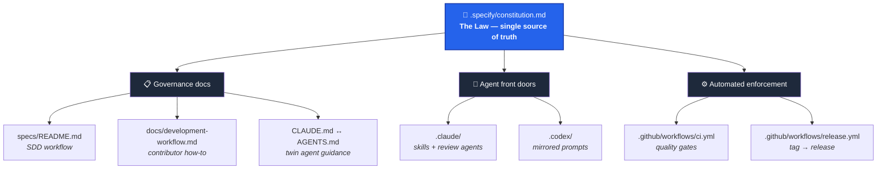
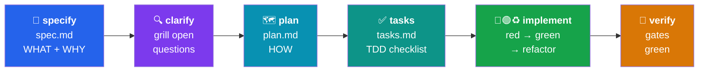
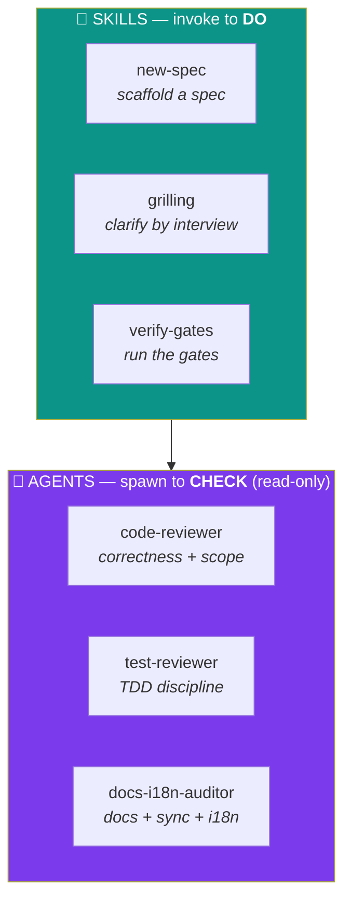
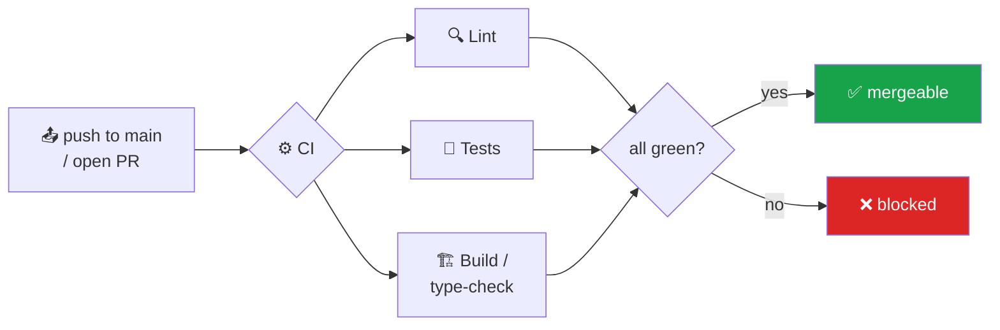
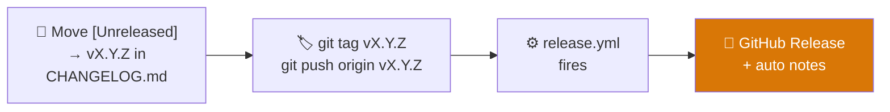

<div align="center">

# 🧭 Dataside-DAIS-Template

### A reusable starting point that gives every project the same engineering discipline

**Spec-Driven Development (SDD)** · **Test-Driven Development (TDD)** · a project **Constitution**
ready-to-use **Claude Code** & **Codex** workflows · automated **Releases** & **Changelog**

<br />


<br />

**🌐 Language:** **English** · [Português 🇧🇷](./README.pt-BR.md)

</div>

---

## 📑 Table of Contents

1. [Introduction](#-1-introduction)
2. [Project Architecture](#-2-project-architecture)
3. [Concepts & Philosophy](#-3-concepts--philosophy)
4. [How to Use This Project](#-4-how-to-use-this-project)
5. [Using with Claude Code](#-5-using-with-claude-code)
6. [Using with Codex](#-6-using-with-codex)
7. [Agents & Skills Explained](#-7-agents--skills-explained)
8. [CI Flow & Workflows](#-8-ci-flow--workflows)
9. [Releases & Changelog](#-9-releases--changelog)
10. [Using It on a Real Dataside Project](#-10-using-it-on-a-real-dataside-project)
11. [Roadmap — Dataside Standards](#-11-roadmap--dataside-standards)

---

## 🚀 1. Introduction

This repository is a **template**: you don't run it, you **start from it**. Every project that
begins here inherits the same opinionated, non-negotiable way of building software — so the 10th
project on the team looks and behaves like the 1st, and any engineer (or AI agent) can drop in and
immediately know the rules.

What you get out of the box:

| 🎁 | Feature |
|----|---------|
| 📜 | A **Constitution** — the principles every change must respect, with an amendment process. |
| 🧩 | **Spec-Driven Development** — write the *what* and *why* before the code, reviewed first. |
| 🧪 | **Test-Driven Development** — acceptance criteria become failing tests before implementation. |
| 🤖 | **Claude Code** skills & review agents, ready to invoke. |
| 🔁 | **Codex parity** — the same standards, mirrored for OpenAI Codex. |
| ⚙️ | **CI workflows** — multi-stack quality gates (Python / Node / frontend presets). |
| 🏷️ | **Automated Releases** — push a `vX.Y.Z` tag → a GitHub Release with auto notes. |

> **The one-line philosophy:** *No feature code without a spec. No behavior change without a failing
> test first. Not "done" until the gates are green.*

---

## 🧱 2. Project Architecture

The template is a set of **layered front doors over one set of rules.** The Constitution is the law;
everything else is a way to apply or enforce it.



### The development flow (every feature travels this path)



### Repository map

```
📦 Dataside-DAIS-Template
├── 📜 .specify/
│   └── constitution.md          # the non-negotiable principles (edit per project)
├── 📂 specs/
│   ├── README.md                # the SDD workflow
│   └── _template/               # copy this to start a feature
│       ├── spec.md              #   WHAT + WHY + acceptance criteria
│       ├── plan.md              #   HOW — approach, affected files
│       └── tasks.md             #   the work, as a TDD checklist
├── 🤖 .claude/
│   ├── README.md                # index of skills & agents
│   ├── skills/                  # new-spec · grilling · verify-gates
│   └── agents/                  # code-reviewer · test-reviewer · docs-i18n-auditor
├── 🔁 .codex/
│   ├── README.md
│   └── prompts/                 # new-spec · grilling · verify-gates · review-code · review-tests
├── ⚙️  .github/workflows/
│   ├── ci.yml                   # multi-stack quality gates
│   └── release.yml              # tag vX.Y.Z → GitHub Release
├── 📖 docs/
│   ├── architecture.md          # living description of the running system
│   └── development-workflow.md  # the contributor companion to the constitution
├── 🧭 CLAUDE.md                  # guidance for Claude Code
├── 🧭 AGENTS.md                  # twin guidance for Codex/others (keep in sync)
└── 🏷️  CHANGELOG.md              # Keep a Changelog skeleton
```

---

## 💡 3. Concepts & Philosophy

Three ideas carry the whole template.

### 📜 The Constitution is the single source of truth

[`​.specify/constitution.md`](.specify/constitution.md) holds the principles. It is amended **on
purpose** (in a PR, with a rationale) — never by accident. Everything else — the docs, the agent
guidance, the CI — *derives from it*. When two things conflict, the Constitution wins.

<details>
<summary><b>The seven principles (click to expand)</b></summary>

| § | Principle | In short |
|---|-----------|----------|
| **§1** | Spec-first (SDD) | No feature code without a spec under `specs/`. |
| **§2** | Test-first (TDD) | A failing test before implementation; tests assert behavior. |
| **§3** | Done = gates green | Lint, tests, build pass. "Done" is never declared on red. |
| **§4** | One source of truth | Each fact lives in one place; docs follow code in the same change. |
| **§5** | Honesty | Nothing mocked is passed off as real; misconfig fails fast. |
| **§6** | Agent guidance in sync | `CLAUDE.md` ↔ `AGENTS.md` ↔ `.claude`/`.codex` move together. |
| **§7** | *(Optional)* Bilingual | User-facing text ships in both `en` and `pt`. |

</details>

### 🧩 SDD — write the intent before the code

The spec answers **what** and **why**; the plan answers **how**; tasks are **the work**. Specs are an
**append-only decision record** (like ADRs/RFCs) — kept permanently, never deleted or renumbered. The
*current state* of the system lives in `docs/`, the *history of decisions* lives in `specs/`.

### 🧪 TDD — prove it works before you trust it

Each acceptance criterion in a spec is a *testable statement* that becomes a *test*. Cycle:
**🔴 red** (write the failing test) → **🟢 green** (make it pass) → **♻️ refactor**. A finished
feature can point from every criterion to the test that proves it.

---

## 🧰 4. How to Use This Project

> **TL;DR** — Create from the template → fill the placeholders → pick your stack → trim the
> Constitution → write your first spec.

### Step 1 — Create from the template

```bash
# GitHub: click "Use this template" → "Create a new repository"
# …or scaffold locally:
npx degit Dataside-Oficial/Dataside-DAIS-Template my-app
cd my-app
```

### Step 2 — Fill the placeholders

Search the repo for `{{...}}` tokens and replace them:

```bash
grep -rl '{{' . --exclude-dir=.git
```

| Placeholder | Replace with |
|-------------|--------------|
| `{{PROJECT_NAME}}` / `{{PROJECT_DESCRIPTION}}` | Your project's name and one-line description |
| `{{MAINTAINER}}` / `{{DATE}}` | Owner and ratification date of the Constitution |
| `{{PYTHON_DIR}}` / `{{NODE_DIR}}` / `{{FRONTEND_DIR}}` | Working directories per stack |
| `{{LINT_CMD}}` / `{{FORMAT_CMD}}` / `{{TEST_CMD}}` / `{{BUILD_CMD}}` | Your real commands |

### Step 3 — Pick your stack

In [`.github/workflows/ci.yml`](.github/workflows/ci.yml) and the `verify-gates` skill, **keep** the
Python / Node / frontend jobs you use, **delete** the rest, and fill in the real commands.

### Step 4 — Trim the Constitution

Keep §1–§6 (generic), keep or delete §7 (bilingual), and **add** any project-specific principles
(an event-protocol contract, a single source of truth for a data model, provider rules…).

### Step 5 — Write spec `000`

Your first feature goes through the `new-spec` skill like everything else. **Never jump to code.**

---

## 🟠 5. Using with Claude Code

Claude Code reads [`CLAUDE.md`](CLAUDE.md) automatically — it's the always-on rulebook. The
[`.claude/`](.claude/) folder adds **skills** (to *do* things) and **agents** (to *check* things).

### Invoke a skill — `/skill-name` or just ask

```text
/new-spec add user authentication
/grilling
/verify-gates
```

| Skill | When to use it |
|-------|----------------|
| 🆕 `new-spec` | A new feature / behavior change / contract change — **before any code** (§1). |
| 🔍 `grilling` | The **clarify** engine — interviews you one question at a time to kill ambiguity. |
| 🚦 `verify-gates` | Before "done"/PR — runs the local CI mirror + the cross-cutting gates. |

### A good Claude Code session looks like this


---

## 🟣 6. Using with Codex

For contributors on **OpenAI Codex**, the same standards are mirrored. Codex reads
[`AGENTS.md`](AGENTS.md) at the repo root automatically (the twin of `CLAUDE.md`), and
[`.codex/prompts/`](.codex/prompts/) holds the prompt equivalents of the Claude skills/agents.

### Invoke a prompt — `/<name>` in Codex

| Prompt | Use it for |
|--------|------------|
| `/new-spec` | Scaffold `specs/NNN-*/` before any feature code (§1). |
| `/grilling` | Clarify — interview one question at a time before code. |
| `/verify-gates` | Run the local CI mirror + cross-cutting gates before a PR. |
| `/review-code` | Audit correctness, conventions, one-source-of-truth, scope (read-only). |
| `/review-tests` | Audit TDD: each AC mapped to a behavioral test (read-only). |

<details>
<summary><b>If Codex only sees the global prompt dir, link them once</b></summary>

```bash
mkdir -p ~/.codex/prompts
ln -sf "$(pwd)/.codex/prompts/"*.md ~/.codex/prompts/
```

</details>

> 🔄 **Keep both sides in sync (§6):** `CLAUDE.md` ↔ `AGENTS.md`, and each `.claude/` skill/agent ↔
> its `.codex/prompts/` counterpart — in the **same** commit a rule changes.

---

## 🤖 7. Agents & Skills Explained

Two kinds of helpers, with different jobs:



### 🧩 Skills — do the recurring rituals

A skill encodes a multi-file ritual so you don't do it by hand. `new-spec` copies the template and
wires the numbering; `grilling` interviews you to resolve open questions; `verify-gates` runs the
full local mirror of CI.

### 🔎 Agents — read-only reviewers

Agents **report, they don't edit.** Spawn them before a PR for the area you touched:

| Agent | What it reviews |
|-------|-----------------|
| `code-reviewer` | Correctness, conventions, one-source-of-truth, no-fake, scope. |
| `test-reviewer` | Each acceptance criterion mapped to a test, behavioral assertions, real deps. |
| `docs-i18n-auditor` | Docs follow code, `CLAUDE.md` ↔ `AGENTS.md` sync, `en`/`pt` parity. |

> 💡 **Extend it:** add project-specific skills (`add-endpoint`, `add-db-table`, …) under
> `.claude/skills/` and **mirror each in `.codex/prompts/`**.

---

## 🔄 8. CI Flow & Workflows

The quality gates in the Constitution (§3) are enforced by [`.github/workflows/ci.yml`](.github/workflows/ci.yml).
It ships with **presets** for Python, Node, and frontend — keep what you use, delete the rest.



> 🔗 **The golden rule:** `ci.yml` and the `verify-gates` skill must stay in lockstep — the local
> command you run is exactly what CI enforces, so "green locally" means "green in CI."

---

## 🚢 9. Releases & Changelog

Releases are automated by [`.github/workflows/release.yml`](.github/workflows/release.yml) and follow
[Semantic Versioning](https://semver.org/) + [Keep a Changelog](https://keepachangelog.com/).



To cut a release:

```bash
# 1. Move the [Unreleased] entries in CHANGELOG.md under a new vX.Y.Z heading
# 2. Tag and push — the workflow does the rest
git tag v1.0.0
git push origin v1.0.0
```

> Pre-release tags (`v1.0.0-rc.1`, `-beta.2`) are automatically flagged as pre-releases. Notes are
> generated from the commits/PRs since the previous tag.

---

## 🟢 10. Using It on a Real Dataside Project

### 🆕 Starting a brand-new project from this template

1. **Create the repo** in `Dataside-Oficial` via *"Use this template"* (keep `main` as the default
   branch).
2. **Replace the placeholders** (Step 2 above) — give the Constitution a real project name, owner,
   and date.
3. **Choose the stack** in `ci.yml` + `verify-gates`: a FastAPI/LangGraph service keeps the Python
   job; a React app keeps the frontend job; a full-stack app keeps both.
4. **Adapt the Constitution to the project:** delete §7 if there's no UI; add a principle for any
   contract the project must protect (e.g. an event protocol, a data-model source of truth).
5. **Replace the placeholder docs:** `docs/architecture.md` describes *your* system;
   `CLAUDE.md` / `AGENTS.md` get the project's real commands and architecture notes.
6. **Write spec `000`** and build the first feature the SDD + TDD way.

### ♻️ Adopting it into an existing project

You don't need to restart — copy the discipline in:

| Bring in | From the template | Then |
|----------|-------------------|------|
| Governance | `.specify/`, `specs/`, `docs/development-workflow.md` | Adapt the Constitution to what the project already does. |
| Agent front doors | `.claude/`, `.codex/`, `CLAUDE.md`, `AGENTS.md` | Merge with any existing `CLAUDE.md`; fill in real commands. |
| Enforcement | `.github/workflows/` | Reconcile with existing CI; point the gates at the real test/lint commands. |

> ✅ **Adoption rule of thumb:** new work follows SDD + TDD from day one. You don't retro-spec the
> whole codebase — you start writing specs and tests for everything you touch from now on.

---

## 🎨 11. Roadmap — Dataside Standards

> 🚧 **Coming soon.** This section will grow into the home for **Dataside-wide standards**, so teams
> stop reinventing (or drifting from) the basics:

- 🎨 **Visual identity & frontend** — Dataside colors, design tokens, and component patterns, so no
  one ships UI that looks off-brand.
- 🔒 **Security best practices** — secret handling, dependency policy, auth baselines.
- 📐 **Engineering guidelines** — naming, repo structure, branching, and review conventions.
- ☁️ **Cloud & deployment standards** — the Dataside-blessed way to ship to Azure / the cloud.

*Have a standard the whole org should share? Propose it here via PR — it becomes part of the template
every new project inherits.*

---

<div align="center">

**📜 The law:** [`.specify/constitution.md`](.specify/constitution.md) ·
**🔄 The workflow:** [`specs/README.md`](specs/README.md) ·
**📖 The how-to:** [`docs/development-workflow.md`](docs/development-workflow.md)

<br />

Made with discipline at **Dataside** · [Português 🇧🇷](./README.pt-BR.md)

</div>
