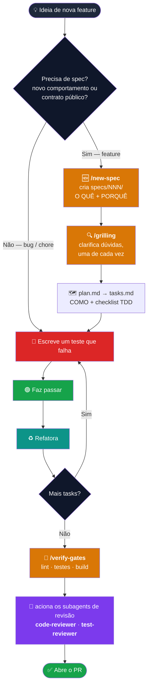
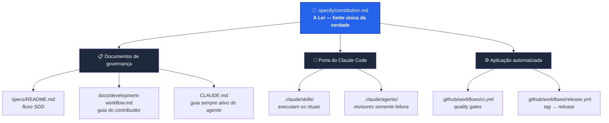
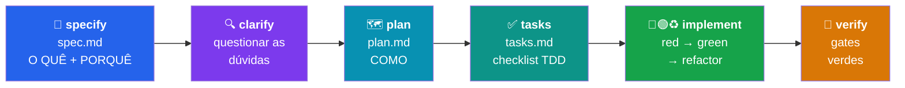
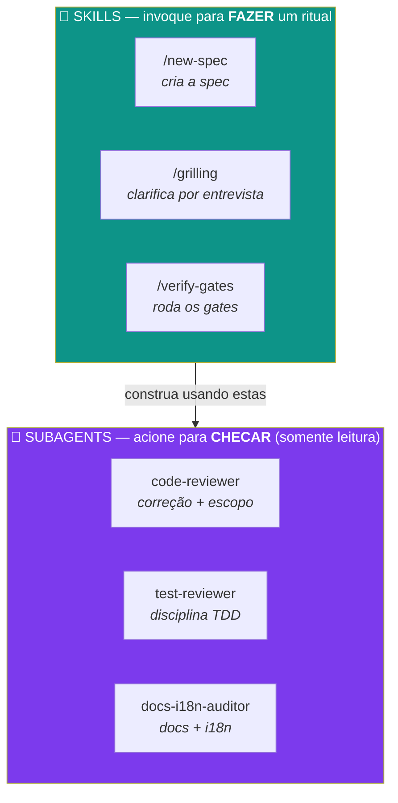
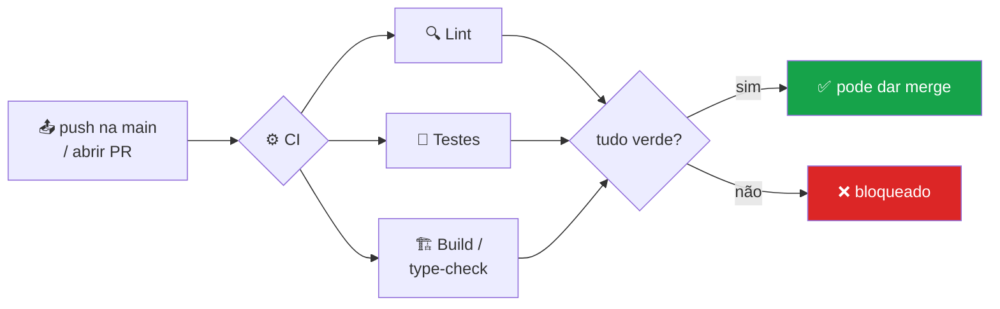
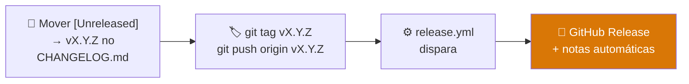

<div align="center">

# 🧭 agent-coding-template

### Um ponto de partida reutilizável que dá a todo projeto a mesma disciplina de engenharia

**Desenvolvimento Orientado a Especificação (SDD)** · **Desenvolvimento Orientado a Testes (TDD)** ·
uma **Constituição** do projeto · skills e subagents de revisão prontos no **Claude Code** ·
**Releases** e **Changelog** automatizados

<br />


<br />

**🌐 Idioma:** [English](./README.md) · **Português** 🇧🇷

</div>

---

## 📑 Sumário

1. [Introdução](#-1-introdução)
2. [Arquitetura do Projeto](#-2-arquitetura-do-projeto)
3. [Conceitos & Filosofia](#-3-conceitos--filosofia)
4. [Skills & Subagents no Claude Code](#-4-skills--subagents-no-claude-code)
5. [Fluxo de CI e Workflows](#-5-fluxo-de-ci-e-workflows)
6. [Releases e Changelog](#-6-releases-e-changelog)
7. [Usando em um Projeto Real](#-7-usando-em-um-projeto-real)
8. [Roadmap — Padrões Compartilhados](#-8-roadmap--padrões-compartilhados)

---

## 🚀 1. Introdução

Este repositório é um **template**: você não o executa, você **começa a partir dele**. Todo projeto
que nasce aqui herda a mesma forma opinativa e inegociável de construir software — de modo que o 10º
projeto do time se pareça e se comporte como o 1º, e qualquer pessoa de engenharia (ou agente de IA)
consiga entrar e já saber as regras.

O que você ganha sem configurar nada:

| 🎁 | Recurso |
|----|---------|
| 📜 | Uma **Constituição** — os princípios que toda mudança deve respeitar, com processo de emenda. |
| 🧩 | **SDD** — escreva o *o quê* e o *porquê* antes do código, revisados primeiro. |
| 🧪 | **TDD** — critérios de aceite viram testes que falham antes da implementação. |
| 🤖 | **Skills** e **subagents** de revisão prontos para o Claude Code. |
| ⚙️ | **Workflows de CI** — quality gates multi-stack (presets Python / Node / frontend). |
| 🏷️ | **Releases automatizados** — uma tag `vX.Y.Z` → uma GitHub Release com notas automáticas. |

> **A filosofia em uma linha:** *Nenhum código de feature sem uma spec. Nenhuma mudança de
> comportamento sem um teste que falha primeiro. Nada é "pronto" até os gates ficarem verdes.*

### 🗺️ A jornada de uma nova feature

Toda feature percorre o mesmo caminho — da ideia ao PR mergeado. As skills do Claude Code (em
**laranja**) e os subagents de revisão (em **roxo**) se encaixam em cada etapa:



> Um passo a passo real desse fluxo dentro do Claude Code está em
> [§4 — Skills & Subagents](#-4-skills--subagents-no-claude-code).

---

## 🧱 2. Arquitetura do Projeto

O template é um conjunto de **portas de entrada em camadas sobre um único conjunto de regras.** A
Constituição é a lei; todo o resto é uma forma de aplicá-la ou de fazê-la valer.



### As etapas de desenvolvimento (o pipeline conceitual)



### Mapa do repositório

```
📦 agent-coding-template
├── 🧩 backend/                   # API · domínio · dados  (Python / FastAPI)
├── 🎨 frontend/                  # UI  (React + TypeScript + CSS)
├── 🤖 ai/                        # agents · prompts · RAG  (Python)
├── ☁️  infra/                    # IaC · deploy  (Terraform)
├── 📜 .specify/
│   └── constitution.md          # os princípios inegociáveis (edite por projeto)
├── 📂 specs/
│   ├── README.md                # o fluxo SDD
│   └── _template/               # copie isto para iniciar uma feature
│       ├── spec.md              #   O QUÊ + PORQUÊ + critérios de aceite
│       ├── plan.md              #   COMO — abordagem, arquivos afetados
│       └── tasks.md             #   o trabalho, como checklist TDD
├── 🤖 .claude/
│   ├── README.md                # índice de skills & subagents
│   ├── skills/                  # new-spec · grilling · verify-gates
│   └── agents/                  # code-reviewer · test-reviewer · docs-i18n-auditor
├── ⚙️  .github/workflows/
│   ├── ci.yml                   # quality gates multi-stack
│   └── release.yml              # tag vX.Y.Z → GitHub Release
├── 📖 docs/
│   ├── architecture.md          # descrição viva do sistema em execução
│   └── development-workflow.md  # o companheiro do contribuidor para a constituição
├── 🧭 CLAUDE.md                  # guia sempre ativo para o Claude Code
└── 🏷️  CHANGELOG.md              # esqueleto Keep a Changelog
```

> 🔁 **Usando OpenAI Codex em vez do Claude Code?** Os mesmos padrões estão espelhados em `AGENTS.md`
> e `.codex/` — deixados de fora deste guia por enquanto para focar em uma ferramenta só.

---

## 💡 3. Conceitos & Filosofia

Três ideias sustentam o template inteiro.

### 📜 A Constituição é a fonte única da verdade

[`​.specify/constitution.md`](.specify/constitution.md) guarda os princípios. Ela é emendada **de
propósito** (em um PR, com justificativa) — nunca por acidente. Todo o resto — os docs, o guia dos
agentes, o CI — *deriva dela*. Quando duas coisas conflitam, a Constituição vence.

<details>
<summary><b>Os sete princípios (clique para expandir)</b></summary>

| § | Princípio | Em resumo |
|---|-----------|-----------|
| **§1** | Spec primeiro (SDD) | Nenhum código de feature sem uma spec em `specs/`. |
| **§2** | Teste primeiro (TDD) | Um teste que falha antes da implementação; testes verificam comportamento. |
| **§3** | Pronto = gates verdes | Lint, testes, build passam. "Pronto" nunca é declarado no vermelho. |
| **§4** | Fonte única da verdade | Cada fato vive em um lugar; docs acompanham o código na mesma mudança. |
| **§5** | Honestidade | Nada falso é apresentado como real; má configuração falha rápido. |
| **§6** | Guia dos agentes em sincronia | `CLAUDE.md` ↔ `AGENTS.md` ↔ `.claude`/`.codex` andam juntos. |
| **§7** | *(Opcional)* Bilíngue | Texto voltado ao usuário é entregue em `en` e `pt`. |

</details>

### 🧩 SDD — escreva a intenção antes do código

A spec responde **o quê** e **porquê**; o plano responde **como**; as tasks são **o trabalho**. Specs
são um **registro de decisões append-only** (como ADRs/RFCs) — mantidas para sempre, nunca apagadas
nem renumeradas. O *estado atual* do sistema vive em `docs/`, o *histórico de decisões* vive em
`specs/`.

### 🧪 TDD — prove que funciona antes de confiar

Cada critério de aceite numa spec é uma *afirmação testável* que vira um *teste*. Ciclo:
**🔴 red** (escreva o teste que falha) → **🟢 green** (faça passar) → **♻️ refactor**. Uma feature
finalizada consegue apontar de cada critério para o teste que o comprova.

---

## 🤖 4. Skills & Subagents no Claude Code

O Claude Code lê [`CLAUDE.md`](CLAUDE.md) automaticamente — é o livro de regras sempre ativo. A pasta
[`.claude/`](.claude/) então adiciona dois tipos de ajudantes com **funções diferentes**:



- **🧩 Skills** codificam um ritual multi-arquivo para você não fazê-lo na mão. Você as invoca com um
  comando de barra (`/new-spec`) ou simplesmente pedindo. Elas **editam arquivos e conduzem o fluxo**.
- **🔎 Subagents** são revisores somente leitura. Eles **reportam, não editam** — acione-os antes de um
  PR para a área que você mexeu.

| Ajudante | Tipo | O que faz |
|----------|------|-----------|
| `/new-spec` | 🧩 skill | Cria `specs/NNN-*/` a partir do template — **antes de qualquer código** (§1). |
| `/grilling` | 🧩 skill | O motor de **clarify** — entrevista uma pergunta por vez para eliminar ambiguidade. |
| `/verify-gates` | 🧩 skill | Roda o espelho local do CI + os gates transversais da constituição. |
| `code-reviewer` | 🔎 subagent | Correção, convenções, fonte única da verdade, escopo. |
| `test-reviewer` | 🔎 subagent | Cada critério de aceite mapeado para um teste de comportamento. |
| `docs-i18n-auditor` | 🔎 subagent | Docs acompanham o código, paridade `en`/`pt` (se bilíngue). |

### 🎬 Uma sessão real — construindo "redefinição de senha"

Veja como o fluxo acima realmente aparece numa conversa com o Claude Code:

```text
Você   ▶  /new-spec redefinição de senha por link de e-mail
Claude ▶  📁 Criei specs/003-redefinicao-senha/ (spec.md, plan.md, tasks.md)
          Rascunhei spec.md com 4 critérios de aceite. Restam algumas dúvidas em aberto.

Você   ▶  /grilling
Claude ▶  P1: O link de redefinição deve expirar? (Recomendado: sim, 30 min) ─ sua resposta?
Você   ▶  sim, 30 minutos
Claude ▶  P2: Um token de redefinição ativo por usuário, ou vários? (Recomendado: um) ─ ?
          …dobra cada resposta de volta no spec.md, move para "clarified".

Você   ▶  planeje e implemente task por task
Claude ▶  🔴 AC-1 → escreve o teste que falha test_link_redefinicao_expira() …
          🟢 implementa até passar …
          ♻️ refatora. Marca o box. Vai para o AC-2.

Você   ▶  /verify-gates
Claude ▶  ✅ lint · ✅ 12 testes · ✅ build — tudo verde.

Você   ▶  use os subagents code-reviewer e test-reviewer nas minhas mudanças
Claude ▶  🔎 code-reviewer: 1 achado (comparação de token não é constant-time) …
          🔎 test-reviewer: cada AC mapeia para um teste ✓. Nenhum achado.
```

> 💡 **Duas formas de acionar um subagent:** peça em linguagem natural (*"revise minhas mudanças com o
> code-reviewer"*) ou deixe o Claude acioná-lo automaticamente na etapa de revisão. De qualquer forma
> ele só **lê** — você mantém o controle de cada edição.

> ➕ **Estenda:** adicione skills específicas do projeto (`add-endpoint`, `add-db-table`, …) em
> `.claude/skills/` para codificar os rituais multi-arquivo recorrentes do seu código.

---

## 🔄 5. Fluxo de CI e Workflows

Os quality gates da Constituição (§3) são aplicados por [`.github/workflows/ci.yml`](.github/workflows/ci.yml).
Ele já vem com **presets** para Python, Node e frontend — mantenha o que usa, apague o resto.



> 🔗 **A regra de ouro:** `ci.yml` e a skill `/verify-gates` devem andar em lockstep — o comando local
> que você roda é exatamente o que o CI aplica, então "verde localmente" significa "verde no CI."

---

## 🚢 6. Releases e Changelog

Os releases são automatizados por [`.github/workflows/release.yml`](.github/workflows/release.yml) e
seguem [Versionamento Semântico](https://semver.org/) + [Keep a Changelog](https://keepachangelog.com/).



Para publicar um release:

```bash
# 1. Mova as entradas de [Unreleased] no CHANGELOG.md sob um novo cabeçalho vX.Y.Z
# 2. Crie a tag e dê push — o workflow faz o resto
git tag v1.0.0
git push origin v1.0.0
```

> Tags de pré-release (`v1.0.0-rc.1`, `-beta.2`) são marcadas automaticamente como pré-release. As
> notas são geradas a partir dos commits/PRs desde a tag anterior.

---

## 🟢 7. Usando em um Projeto Real

### 🆕 Começando um projeto novo a partir deste template

Este repo é um **GitHub template repository**, então você não faz fork nem copia na mão — o GitHub
gera um repositório novo, sem histórico, pra você.

**Passo 1 — Crie o repositório (escolha um).**

```bash
# ✅ Opção A — nativo do GitHub (recomendado): cria a partir do template + clona, num comando só
gh repo create reginaldosilva27/meu-app \
  --template reginaldosilva27/agent-coding-template \
  --public --clone
cd meu-app
```

```bash
# Opção B — clonar & re-inicializar localmente (começa seu próprio histórico)
git clone https://github.com/reginaldosilva27/agent-coding-template.git meu-app
cd meu-app
rm -rf .git && git init && git add -A && git commit -m "chore: bootstrap a partir do agent-coding-template"
# depois crie o repo vazio no GitHub e dê push:
git remote add origin https://github.com/reginaldosilva27/meu-app.git
git branch -M main && git push -u origin main
```

> 💡 Renomear a pasta = renomear o projeto. O diretório onde você clona (`meu-app`) é a raiz do seu
> projeto — não há mais nada para renomear.

**Passo 2 — Mantenha só as camadas que você usa.** O esqueleto de arquitetura já existe; basta
**apagar as pastas que não vai usar** (uma API headless apaga `frontend/`; um projeto sem IA apaga
`ai/`):

```
meu-app/
├── backend/    # Python / FastAPI      ── manter / apagar
├── frontend/   # React + TS + CSS      ── manter / apagar
├── ai/         # agents · prompts · RAG ── manter / apagar
└── infra/      # Terraform / IaC       ── manter / apagar
```

**Passo 3 — Preencha 4 placeholders (só a identidade do projeto é templada).** Os diretórios e
comandos já estão ligados, então só resta dizer *quem/o que é este projeto*. Veja **exatamente onde
cada um vive**:

| Placeholder | O que é | Arquivos que o contêm |
|-------------|---------|-----------------------|
| `{{PROJECT_NAME}}` | Nome do projeto | `.specify/constitution.md` · `.claude/agents/*.md` |
| `{{PROJECT_DESCRIPTION}}` | Descrição em uma linha | `CLAUDE.md` · `AGENTS.md` · `.specify/constitution.md` |
| `{{MAINTAINER}}` | Responsável / mantenedor | `.specify/constitution.md` |
| `{{DATE}}` | Data de ratificação da Constituição | `.specify/constitution.md` |

Liste os que sobraram a qualquer momento com `grep -rn '{{' . --exclude-dir=.git`. Para substituir um
valor em todos os arquivos de uma vez (repita por placeholder):

```bash
# macOS (BSD sed). No Linux, remova o '' depois do -i.
grep -rl '{{PROJECT_NAME}}' . --exclude-dir=.git | xargs sed -i '' 's/{{PROJECT_NAME}}/Meu App/g'
```

> #### ⚠️ Esses placeholders **não** são variáveis de ambiente
>
> São texto literal dentro dos arquivos do repo — você os substitui **uma vez**, e ficam commitados
> como texto. **Secrets de runtime são outra coisa**: chaves de API e URLs de banco vão em um `.env`
> local e em **secrets do GitHub Actions**, nunca commitados (constituição §5).
>
> | Tipo | Exemplo | Vive em | Commitado? |
> |------|---------|---------|------------|
> | Placeholder do template | `{{PROJECT_NAME}}` | nos arquivos do repo (substituído 1×) | ✅ sim, como texto |
> | Secret de runtime | `OPENAI_API_KEY`, `DATABASE_URL` | `.env` local · secrets do CI no GitHub | ❌ nunca |

**Passo 4 — Ajuste a stack (opcional).** Cada camada já vem com um default sensato (Python para
`backend/`+`ai/`, React/TS para `frontend/`, Terraform para `infra/`). Se uma camada usar outra coisa,
troque o tooling em [`.github/workflows/ci.yml`](.github/workflows/ci.yml) e na skill `/verify-gates`
— eles já apontam para as pastas certas. (O CI pula automaticamente cada camada até ela ter código.)

**Passo 5 — Adapte a Constituição.** Mantenha §1–§6 (genéricos), mantenha ou apague §7 (bilíngue) e
**adicione** qualquer princípio específico do projeto — um contrato de protocolo de eventos, uma fonte
única da verdade de um modelo de dados, regras de provider.

**Passo 6 — Substitua os docs de placeholder & escreva a spec `000`.** `docs/architecture.md` descreve
o *seu* sistema; depois construa a primeira feature do jeito SDD + TDD. **Nunca pule direto para o
código.**

### ♻️ Adotando em um projeto já existente

Você não precisa recomeçar — traga a disciplina para dentro:

| Traga | Do template | Depois |
|-------|-------------|--------|
| Governança | `.specify/`, `specs/`, `docs/development-workflow.md` | Adapte a Constituição ao que o projeto já faz. |
| Porta do Claude Code | `.claude/`, `CLAUDE.md` | Una com qualquer `CLAUDE.md` existente; preencha os comandos reais. |
| Aplicação | `.github/workflows/` | Reconcilie com o CI existente; aponte os gates para os comandos reais de teste/lint. |

> ✅ **Regra de bolso para adoção:** o trabalho novo segue SDD + TDD desde o primeiro dia. Você não
> escreve specs retroativas para o código inteiro — você passa a escrever specs e testes para tudo
> que tocar daqui em diante.

---

## 🎨 8. Roadmap — Padrões Compartilhados

> 🚧 **Em breve.** Esta seção vai crescer até ser a casa dos **padrões compartilhados**, para que todo
> projeto criado a partir deste template saia com a mesma identidade de engenharia sem ninguém
> reinventar o básico:

- 🎨 **Identidade visual & frontend** — design tokens e padrões de componentes, para nenhuma UI sair
  fora da marca.
- 🔒 **Boas práticas de segurança** — tratamento de secrets, política de dependências e baseline de
  autenticação.
- 📐 **Diretrizes de engenharia** — nomenclatura, estrutura de repositório, branching e convenções de
  revisão.
- ☁️ **Padrões de dados & cloud** — formas opinativas de entregar em Azure / Databricks / Snowflake / AWS.

*Tem um padrão que vale a pena compartilhar? Proponha aqui via PR — ele passa a fazer parte do
template que todo projeto novo herda.*

---

<div align="center">

**📜 A lei:** [`.specify/constitution.md`](.specify/constitution.md) ·
**🔄 O fluxo:** [`specs/README.md`](specs/README.md) ·
**📖 O guia:** [`docs/development-workflow.md`](docs/development-workflow.md)

<br />

Feito com disciplina por [**@reginaldosilva27**](https://github.com/reginaldosilva27) · [English](./README.md)

</div>
