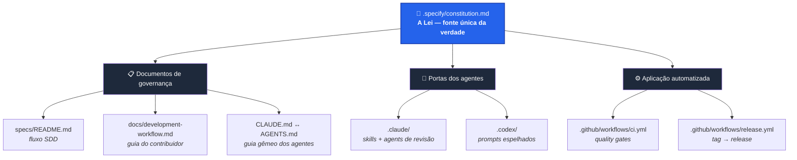
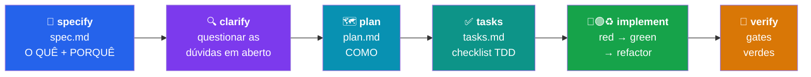
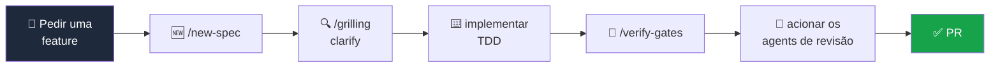
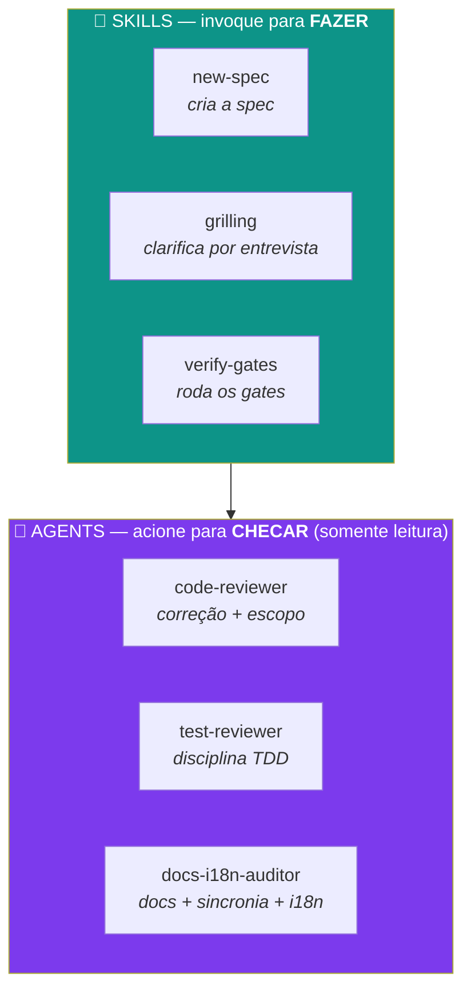
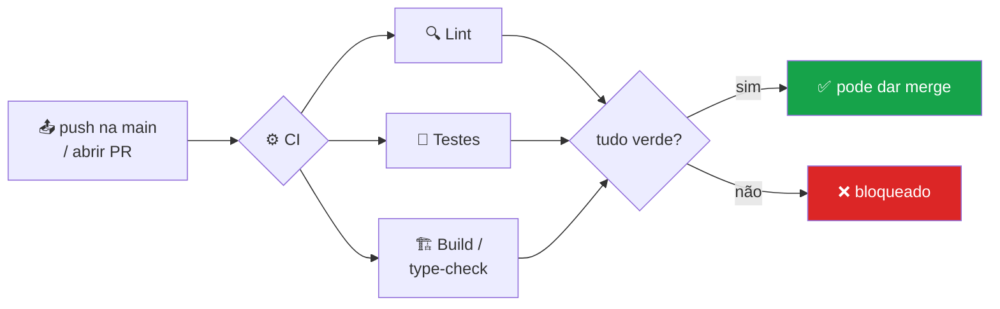
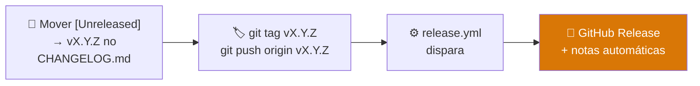

<div align="center">

# 🧭 Dataside-DAIS-Template

### Um ponto de partida reutilizável que dá a todo projeto a mesma disciplina de engenharia

**Desenvolvimento Orientado a Especificação (SDD)** · **Desenvolvimento Orientado a Testes (TDD)** ·
uma **Constituição** do projeto · workflows prontos para **Claude Code** e **Codex** ·
**Releases** e **Changelog** automatizados

<br />


<br />

**🌐 Idioma:** [English](./README.md) · **Português** 🇧🇷

</div>

---

## 📑 Sumário

1. [Introdução](#-1-introdução)
2. [Arquitetura do Projeto](#-2-arquitetura-do-projeto)
3. [Conceitos & Filosofia](#-3-conceitos--filosofia)
4. [Como Usar Este Projeto](#-4-como-usar-este-projeto)
5. [Usando no Claude Code](#-5-usando-no-claude-code)
6. [Usando no Codex](#-6-usando-no-codex)
7. [Agents & Skills Explicados](#-7-agents--skills-explicados)
8. [Fluxo de CI & Workflows](#-8-fluxo-de-ci--workflows)
9. [Releases & Changelog](#-9-releases--changelog)
10. [Usando em um Projeto Real da Dataside](#-10-usando-em-um-projeto-real-da-dataside)
11. [Roadmap — Padrões Dataside](#-11-roadmap--padrões-dataside)

---

## 🚀 1. Introdução

Este repositório é um **template**: você não o executa, você **começa a partir dele**. Todo projeto
que nasce aqui herda a mesma forma opinativa e inegociável de construir software — de modo que o 10º
projeto do time se pareça e se comporte como o 1º, e qualquer pessoa de engenharia (ou agente de IA)
consiga entrar e já saber as regras.

O que você ganha sem configurar nada:

| 🎁 | Recurso |
|----|---------|
| 📜 | Uma **Constituição** — os princípios que toda mudança deve respeitar, com processo de emenda. |
| 🧩 | **SDD** — escreva o *o quê* e o *porquê* antes do código, revisados primeiro. |
| 🧪 | **TDD** — critérios de aceite viram testes que falham antes da implementação. |
| 🤖 | **Skills** e **agents** de revisão prontos para o Claude Code. |
| 🔁 | **Paridade com Codex** — os mesmos padrões, espelhados para o OpenAI Codex. |
| ⚙️ | **Workflows de CI** — quality gates multi-stack (presets Python / Node / frontend). |
| 🏷️ | **Releases automatizados** — uma tag `vX.Y.Z` → uma GitHub Release com notas automáticas. |

> **A filosofia em uma linha:** *Nenhum código de feature sem uma spec. Nenhuma mudança de
> comportamento sem um teste que falha primeiro. Nada é "pronto" até os gates ficarem verdes.*

---

## 🧱 2. Arquitetura do Projeto

O template é um conjunto de **portas de entrada em camadas sobre um único conjunto de regras.** A
Constituição é a lei; todo o resto é uma forma de aplicá-la ou de fazê-la valer.



### O fluxo de desenvolvimento (toda feature percorre este caminho)



### Mapa do repositório

```
📦 Dataside-DAIS-Template
├── 📜 .specify/
│   └── constitution.md          # os princípios inegociáveis (edite por projeto)
├── 📂 specs/
│   ├── README.md                # o fluxo SDD
│   └── _template/               # copie isto para iniciar uma feature
│       ├── spec.md              #   O QUÊ + PORQUÊ + critérios de aceite
│       ├── plan.md              #   COMO — abordagem, arquivos afetados
│       └── tasks.md             #   o trabalho, como checklist TDD
├── 🤖 .claude/
│   ├── README.md                # índice de skills & agents
│   ├── skills/                  # new-spec · grilling · verify-gates
│   └── agents/                  # code-reviewer · test-reviewer · docs-i18n-auditor
├── 🔁 .codex/
│   ├── README.md
│   └── prompts/                 # new-spec · grilling · verify-gates · review-code · review-tests
├── ⚙️  .github/workflows/
│   ├── ci.yml                   # quality gates multi-stack
│   └── release.yml              # tag vX.Y.Z → GitHub Release
├── 📖 docs/
│   ├── architecture.md          # descrição viva do sistema em execução
│   └── development-workflow.md  # o companheiro do contribuidor para a constituição
├── 🧭 CLAUDE.md                  # guia para o Claude Code
├── 🧭 AGENTS.md                  # guia gêmeo para Codex/outros (manter em sincronia)
└── 🏷️  CHANGELOG.md              # esqueleto Keep a Changelog
```

---

## 💡 3. Conceitos & Filosofia

Três ideias sustentam o template inteiro.

### 📜 A Constituição é a fonte única da verdade

[`​.specify/constitution.md`](.specify/constitution.md) guarda os princípios. Ela é emendada **de
propósito** (em um PR, com justificativa) — nunca por acidente. Todo o resto — os docs, o guia dos
agentes, o CI — *deriva dela*. Quando duas coisas conflitam, a Constituição vence.

<details>
<summary><b>Os sete princípios (clique para expandir)</b></summary>

| § | Princípio | Em resumo |
|---|-----------|-----------|
| **§1** | Spec primeiro (SDD) | Nenhum código de feature sem uma spec em `specs/`. |
| **§2** | Teste primeiro (TDD) | Um teste que falha antes da implementação; testes verificam comportamento. |
| **§3** | Pronto = gates verdes | Lint, testes, build passam. "Pronto" nunca é declarado no vermelho. |
| **§4** | Fonte única da verdade | Cada fato vive em um lugar; docs acompanham o código na mesma mudança. |
| **§5** | Honestidade | Nada falso é apresentado como real; má configuração falha rápido. |
| **§6** | Guia dos agentes em sincronia | `CLAUDE.md` ↔ `AGENTS.md` ↔ `.claude`/`.codex` andam juntos. |
| **§7** | *(Opcional)* Bilíngue | Texto voltado ao usuário é entregue em `en` e `pt`. |

</details>

### 🧩 SDD — escreva a intenção antes do código

A spec responde **o quê** e **porquê**; o plano responde **como**; as tasks são **o trabalho**. Specs
são um **registro de decisões append-only** (como ADRs/RFCs) — mantidas para sempre, nunca apagadas
nem renumeradas. O *estado atual* do sistema vive em `docs/`, o *histórico de decisões* vive em
`specs/`.

### 🧪 TDD — prove que funciona antes de confiar

Cada critério de aceite numa spec é uma *afirmação testável* que vira um *teste*. Ciclo:
**🔴 red** (escreva o teste que falha) → **🟢 green** (faça passar) → **♻️ refactor**. Uma feature
finalizada consegue apontar de cada critério para o teste que o comprova.

---

## 🧰 4. Como Usar Este Projeto

> **Resumo** — Crie a partir do template → preencha os placeholders → escolha sua stack → enxugue a
> Constituição → escreva sua primeira spec.

### Passo 1 — Crie a partir do template

```bash
# GitHub: clique em "Use this template" → "Create a new repository"
# …ou faça o scaffold localmente:
npx degit Dataside-Oficial/Dataside-DAIS-Template meu-app
cd meu-app
```

### Passo 2 — Preencha os placeholders

Procure pelos tokens `{{...}}` no repositório e substitua:

```bash
grep -rl '{{' . --exclude-dir=.git
```

| Placeholder | Substitua por |
|-------------|---------------|
| `{{PROJECT_NAME}}` / `{{PROJECT_DESCRIPTION}}` | Nome e descrição em uma linha do projeto |
| `{{MAINTAINER}}` / `{{DATE}}` | Responsável e data de ratificação da Constituição |
| `{{PYTHON_DIR}}` / `{{NODE_DIR}}` / `{{FRONTEND_DIR}}` | Diretórios de trabalho por stack |
| `{{LINT_CMD}}` / `{{FORMAT_CMD}}` / `{{TEST_CMD}}` / `{{BUILD_CMD}}` | Seus comandos reais |

### Passo 3 — Escolha sua stack

Em [`.github/workflows/ci.yml`](.github/workflows/ci.yml) e na skill `verify-gates`, **mantenha** os
jobs de Python / Node / frontend que você usa, **apague** o resto e preencha os comandos reais.

### Passo 4 — Enxugue a Constituição

Mantenha §1–§6 (genéricos), mantenha ou apague §7 (bilíngue) e **adicione** princípios específicos do
projeto (um contrato de protocolo de eventos, uma fonte única da verdade para um modelo de dados,
regras de provider…).

### Passo 5 — Escreva a spec `000`

Sua primeira feature passa pela skill `new-spec` como tudo o mais. **Nunca pule direto para o código.**

---

## 🟠 5. Usando no Claude Code

O Claude Code lê [`CLAUDE.md`](CLAUDE.md) automaticamente — é o livro de regras sempre ativo. A pasta
[`.claude/`](.claude/) adiciona **skills** (para *fazer* coisas) e **agents** (para *checar* coisas).

### Invoque uma skill — `/nome-da-skill` ou simplesmente peça

```text
/new-spec adicionar autenticação de usuário
/grilling
/verify-gates
```

| Skill | Quando usar |
|-------|-------------|
| 🆕 `new-spec` | Nova feature / mudança de comportamento / mudança de contrato — **antes de qualquer código** (§1). |
| 🔍 `grilling` | O motor de **clarify** — entrevista uma pergunta por vez para eliminar ambiguidade. |
| 🚦 `verify-gates` | Antes de "pronto"/PR — roda o espelho local do CI + os gates transversais. |

### Uma boa sessão no Claude Code é assim



---

## 🟣 6. Usando no Codex

Para quem usa **OpenAI Codex**, os mesmos padrões estão espelhados. O Codex lê
[`AGENTS.md`](AGENTS.md) na raiz do repositório automaticamente (o gêmeo do `CLAUDE.md`), e
[`.codex/prompts/`](.codex/prompts/) guarda os equivalentes em prompt das skills/agents do Claude.

### Invoque um prompt — `/<nome>` no Codex

| Prompt | Use para |
|--------|----------|
| `/new-spec` | Fazer o scaffold de `specs/NNN-*/` antes de qualquer código de feature (§1). |
| `/grilling` | Clarify — entrevistar uma pergunta por vez antes do código. |
| `/verify-gates` | Rodar o espelho local do CI + gates transversais antes de um PR. |
| `/review-code` | Auditar correção, convenções, fonte única da verdade, escopo (somente leitura). |
| `/review-tests` | Auditar TDD: cada critério mapeado para um teste de comportamento (somente leitura). |

<details>
<summary><b>Se o Codex só enxerga o diretório global de prompts, faça o link uma vez</b></summary>

```bash
mkdir -p ~/.codex/prompts
ln -sf "$(pwd)/.codex/prompts/"*.md ~/.codex/prompts/
```

</details>

> 🔄 **Mantenha os dois lados em sincronia (§6):** `CLAUDE.md` ↔ `AGENTS.md`, e cada skill/agent do
> `.claude/` ↔ seu equivalente em `.codex/prompts/` — no **mesmo** commit em que uma regra muda.

---

## 🤖 7. Agents & Skills Explicados

Dois tipos de ajudantes, com funções diferentes:



### 🧩 Skills — executam os rituais recorrentes

Uma skill codifica um ritual multi-arquivo para você não fazê-lo na mão. `new-spec` copia o template e
configura a numeração; `grilling` te entrevista para resolver dúvidas em aberto; `verify-gates` roda o
espelho local completo do CI.

### 🔎 Agents — revisores somente leitura

Agents **reportam, não editam.** Acione-os antes de um PR para a área que você mexeu:

| Agent | O que revisa |
|-------|--------------|
| `code-reviewer` | Correção, convenções, fonte única da verdade, nada falso, escopo. |
| `test-reviewer` | Cada critério de aceite mapeado para um teste, asserções de comportamento, deps reais. |
| `docs-i18n-auditor` | Docs acompanham o código, sincronia `CLAUDE.md` ↔ `AGENTS.md`, paridade `en`/`pt`. |

> 💡 **Estenda:** adicione skills específicas do projeto (`add-endpoint`, `add-db-table`, …) em
> `.claude/skills/` e **espelhe cada uma em `.codex/prompts/`**.

---

## 🔄 8. Fluxo de CI & Workflows

Os quality gates da Constituição (§3) são aplicados por [`.github/workflows/ci.yml`](.github/workflows/ci.yml).
Ele já vem com **presets** para Python, Node e frontend — mantenha o que usa, apague o resto.



> 🔗 **A regra de ouro:** `ci.yml` e a skill `verify-gates` devem andar em lockstep — o comando local
> que você roda é exatamente o que o CI aplica, então "verde localmente" significa "verde no CI."

---

## 🚢 9. Releases & Changelog

Os releases são automatizados por [`.github/workflows/release.yml`](.github/workflows/release.yml) e
seguem [Versionamento Semântico](https://semver.org/) + [Keep a Changelog](https://keepachangelog.com/).



Para publicar um release:

```bash
# 1. Mova as entradas de [Unreleased] no CHANGELOG.md sob um novo cabeçalho vX.Y.Z
# 2. Crie a tag e dê push — o workflow faz o resto
git tag v1.0.0
git push origin v1.0.0
```

> Tags de pré-release (`v1.0.0-rc.1`, `-beta.2`) são marcadas automaticamente como pré-release. As
> notas são geradas a partir dos commits/PRs desde a tag anterior.

---

## 🟢 10. Usando em um Projeto Real da Dataside

### 🆕 Começando um projeto novo a partir deste template

1. **Crie o repositório** em `Dataside-Oficial` via *"Use this template"* (mantenha `main` como
   branch padrão).
2. **Substitua os placeholders** (Passo 2 acima) — dê à Constituição um nome de projeto, responsável
   e data reais.
3. **Escolha a stack** em `ci.yml` + `verify-gates`: um serviço FastAPI/LangGraph mantém o job de
   Python; um app React mantém o job de frontend; um app full-stack mantém os dois.
4. **Adapte a Constituição ao projeto:** apague §7 se não houver UI; adicione um princípio para
   qualquer contrato que o projeto precise proteger (ex.: um protocolo de eventos, uma fonte única da
   verdade de um modelo de dados).
5. **Substitua os docs de placeholder:** `docs/architecture.md` descreve o *seu* sistema;
   `CLAUDE.md` / `AGENTS.md` recebem os comandos e notas de arquitetura reais do projeto.
6. **Escreva a spec `000`** e construa a primeira feature do jeito SDD + TDD.

### ♻️ Adotando em um projeto já existente

Você não precisa recomeçar — traga a disciplina para dentro:

| Traga | Do template | Depois |
|-------|-------------|--------|
| Governança | `.specify/`, `specs/`, `docs/development-workflow.md` | Adapte a Constituição ao que o projeto já faz. |
| Portas dos agentes | `.claude/`, `.codex/`, `CLAUDE.md`, `AGENTS.md` | Una com qualquer `CLAUDE.md` existente; preencha os comandos reais. |
| Aplicação | `.github/workflows/` | Reconcilie com o CI existente; aponte os gates para os comandos reais de teste/lint. |

> ✅ **Regra de bolso para adoção:** o trabalho novo segue SDD + TDD desde o primeiro dia. Você não
> escreve specs retroativas para o código inteiro — você passa a escrever specs e testes para tudo
> que tocar daqui em diante.

---

## 🎨 11. Roadmap — Padrões Dataside

> 🚧 **Em breve.** Esta seção vai crescer até ser a casa dos **padrões de toda a Dataside**, para que
> os times parem de reinventar (ou se afastar) do básico:

- 🎨 **Identidade visual & frontend** — cores da Dataside, design tokens e padrões de componentes,
  para ninguém entregar UI fora da marca.
- 🔒 **Boas práticas de segurança** — tratamento de secrets, política de dependências, baseline de
  autenticação.
- 📐 **Diretrizes de engenharia** — nomenclatura, estrutura de repositório, branching e convenções de
  revisão.
- ☁️ **Padrões de cloud & deploy** — o jeito abençoado pela Dataside de subir para a Azure / a nuvem.

*Tem um padrão que toda a organização deveria compartilhar? Proponha aqui via PR — ele passa a fazer
parte do template que todo projeto novo herda.*

---

<div align="center">

**📜 A lei:** [`.specify/constitution.md`](.specify/constitution.md) ·
**🔄 O fluxo:** [`specs/README.md`](specs/README.md) ·
**📖 O guia:** [`docs/development-workflow.md`](docs/development-workflow.md)

<br />

Feito com disciplina na **Dataside** · [English](./README.md)

</div>
